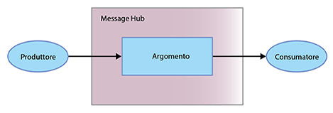

---

copyright:
  years: 2015, 2017
lastupdated: "2017-09-26"

---

{:new_window: target="_blank"}
{:shortdesc: .shortdesc}
{:screen: .screen}
{:codeblock: .codeblock}
{:pre: .pre}

# Introduzione a Message Hub
{: #messagehub}

{{site.data.keyword.messagehub_full}} è un servizio di messaggistica
scalabile, distribuito e a velocità elevata che consente alle applicazioni e ai servizi di comunicare
in modo semplice e affidabile.
{:shortdesc}

Utilizzando {{site.data.keyword.messagehub}}, puoi
completare le seguenti attività:

* Scaricare il lavoro nei processi di lavoro di back-end 
* Connettere i dati di flusso alle funzioni di analisi per realizzare delle potenti analisi approfondite
* Fornire i dati di evento a più applicazioni per delle reazioni in tempo reale
* Trasferire i dati in un altro servizio come l'archiviazione di lungo termine

Per iniziare a utilizzare {{site.data.keyword.messagehub}}
e a inviare e ricevere messaggi, puoi utilizzare l'esempio Java™. L'esempio mostra in che modo un produttore invia
i messaggi a un consumatore utilizzando un argomento. Viene utilizzato lo stesso programma di esempio sia per consumare che per produrre
i messaggi.




Completa la seguente procedura:
{: #getting_started_steps}
 
1. Crea un'istanza del servizio {{site.data.keyword.messagehub}}:

  a. Accedi a {{site.data.keyword.Bluemix_notm}} utilizzando l'interfaccia utente Web. 
  
  b. Fai clic su **CATALOGO**.
  
  c. Nella sezione **Servizi dell'applicazione**, fai clic su **{{site.data.keyword.messagehub}}**. Viene visualizzata la pagina dell'istanza del servizio {{site.data.keyword.messagehub}}.
  
  d. Nel menu **Connetti a** lascia il servizio senza binding e immetti i nomi per il tuo servizio e le tue credenziali. Puoi utilizzare i valori predefiniti.
  
  e. Fai clic su **Crea**.

2. Se non li hai ancora, installa i seguenti prerequisiti:

    * [git ](https://git-scm.com/){:new_window}
	* [Gradle ](https://gradle.org/){:new_window}
    * Java 7 o superiore
 
3. Clona il repository git message-hub-samples immettendo il seguente comando dalla riga di comando:

    <pre class="pre">
    git clone https://github.com/ibm-messaging/message-hub-samples.git
    </pre>
	{: codeblock}

4. Modifica la directory dell'esempio della console java immettendo il seguente comando:

    <pre class="pre">
    cd message-hub-samples/kafka-java-console-sample
    </pre>
	{: codeblock}

5. Esegui questi comandi build:

    <pre class="pre">
    gradle clean && gradle build
    </pre>
	{: codeblock}

6. Avvia il consumatore sulla tua console immettendo il seguente comando:

    <pre class="pre">java -jar build/libs/kafka-java-console-sample-2.0.jar 
	<var class="keyword varname">kafka_brokers_sasl</var> <var class="keyword varname">kafka_admin_url</var> <var class="keyword varname">api_key</var> -consumer</pre>
    {: codeblock}
    
    L'esempio utilizza un argomento denominato `kafka-java-console-sample-topic`. Se l'argomento non esiste
    già, viene creato dall'esempio utilizzando l'API di amministrazione {{site.data.keyword.messagehub}}. Per inviare e ricevere i
    messaggi, l'esempio usa l'API Java Apache Kafka.

    Per trovare i valori di *kafka_brokers_sasl*, *kafka_admin_url*
    e *api_key*, vai alla tua istanza di {{site.data.keyword.messagehub}} in {{site.data.keyword.Bluemix_notm}}, passa alla scheda **Credenziali del servizio** e seleziona le **Credenziali** che vuoi utilizzare.
    
	**Importante:** *kafka_brokers_sasl* deve essere una singola stringa e deve essere racchiusa tra virgolette. Ad esempio:

    <pre class="pre">
    "host1:port1,host2:port2"
    </pre>
	{: codeblock}

    Si consiglia di utilizzare tutti gli host Kafka elencati nelle **Credenziali** che hai selezionato.

7. Avvia il produttore sulla tua console immettendo il seguente comando:
   
    <pre class="pre">java -jar build/libs/kafka-java-console-sample-2.0.jar 
	<var class="keyword varname">kafka_brokers_sasl</var> <var class="keyword varname">kafka_admin_url</var> <var class="keyword varname">api_key</var> -producer</pre>
 {: codeblock}
  
8. Dovresti ora vedere i messaggi inviati dal produttore che compaiono nel consumatore. Di seguito è
riportato un output di esempio:

    ```
    [2016-11-30 17:30:53,492] INFO Running in local mode. (com.messagehub.samples.MessageHubConsoleSample)
    [2016-11-30 17:30:53,492] INFO Updating JAAS configuration (com.messagehub.samples.MessageHubConsoleSample)
    [2016-11-30 17:30:53,506] INFO Kafka Endpoints: kafka01-prod01.messagehub.services.us-south.bluemix.net:9093,kafka02-prod01.messagehub.services.us-south.bluemix.net:9093,kafka03-prod01.messagehub.services.us-south.bluemix.net:9093,kafka04-prod01.messagehub.services.us-south.bluemix.net:9093,kafka05-prod01.messagehub.services.us-south.bluemix.net:9093 (com.messagehub.samples.MessageHubConsoleSample)
    [2016-11-30 17:30:53,506] INFO Admin REST Endpoint: https://kafka-admin-prod01.messagehub.services.us-south.bluemix.net:443 (com.messagehub.samples.MessageHubConsoleSample)
    [2016-11-30 17:30:53,506] INFO Creating the topic kafka-java-console-sample-topic (com.messagehub.samples.MessageHubConsoleSample)
    (com.messagehub.samples.MessageHubConsoleSample)e :{}
    [2016-11-30 17:30:54,947] INFO Admin REST Listing Topics: [{"name":"kafka-java-console-sample-topic","partitions":1,"retentionMs":"86400000","markedForDeletion":false}] (com.messagehub.samples.MessageHubConsoleSample)
    [2016-11-30 17:30:55,952] INFO [Partition(topic = kafka-java-console-sample-topic, partition = 0, leader = 0, replicas = [0,1,4,], isr = [0,4,1,]] (com.messagehub.samples.ConsumerRunnable)
    [2016-11-30 17:30:55,953] INFO class com.messagehub.samples.ConsumerRunnable is starting. (com.messagehub.samples.ConsumerRunnable)
    [2016-11-30 17:30:57,023] INFO [Partition(topic = kafka-java-console-sample-topic, partition = 0, leader = 0, replicas = [0,1,4,], isr = [0,4,1,]] (com.messagehub.samples.ProducerRunnable)
    [2016-11-30 17:30:57,024] INFO MessageHubConsoleSample will run until interrupted. (com.messagehub.samples.MessageHubConsoleSample)
    [2016-11-30 17:30:57,024] INFO class com.messagehub.samples.ProducerRunnable is starting. (com.messagehub.samples.ProducerRunnable)
    [2016-11-30 17:30:58,018] INFO Message produced, offset: 0 (com.messagehub.samples.ProducerRunnable)
    [2016-11-30 17:30:58,956] INFO No messages consumed (com.messagehub.samples.ConsumerRunnable)
    [2016-11-30 17:31:00,301] INFO Message consumed: ConsumerRecord(topic = kafka-java-console-sample-topic, partition = 0, offset = 1, CreateTime = 1480527060022, checksum = 1906962734, serialized key size = 3, serialized value size = 25, key = key, value = This is a test message #1) (com.messagehub.samples.ConsumerRunnable)
    [2016-11-30 17:31:00,397] INFO Message produced, offset: 1 (com.messagehub.samples.ProducerRunnable)
    [2016-11-30 17:31:02,550] INFO Message consumed: ConsumerRecord(topic = kafka-java-console-sample-topic, partition = 0, offset = 2, CreateTime = 1480527062401, checksum = 3801731428, serialized key size = 3, serialized value size = 25, key = key, value = This is a test message #2) (com.messagehub.samples.ConsumerRunnable)
    ```
	{: codeblock}
	
9. L'esempio viene eseguito indefinitamente finché non viene arrestato. Per arrestare il processo, esegui un comando simile
a questo: <code>Ctrl+C</code>


Per ulteriori informazioni sull'esecuzione di un esempio {{site.data.keyword.messagehub}} con Python, vedi [Applicazione di esempio della console Python](https://developer.ibm.com/messaging/2017/02/09/new-message-hub-sample-python-console-application/){:new_window}. Puoi anche trovare esempi
che mostrano altre API e funzioni in [Esempi di {{site.data.keyword.messagehub}} ](https://github.com/ibm-messaging/message-hub-samples){:new_window}.

Per guardare un video che ti mostra
in dettaglio come ottenere un esempio Java da eseguire in {{site.data.keyword.messagehub}}, vedi [{{site.data.keyword.messagehub}} - Getting started with IBM's Kafka in the cloud ](https://www.youtube.com/watch?v=tt-bLtFzC_4){:new_window}.

