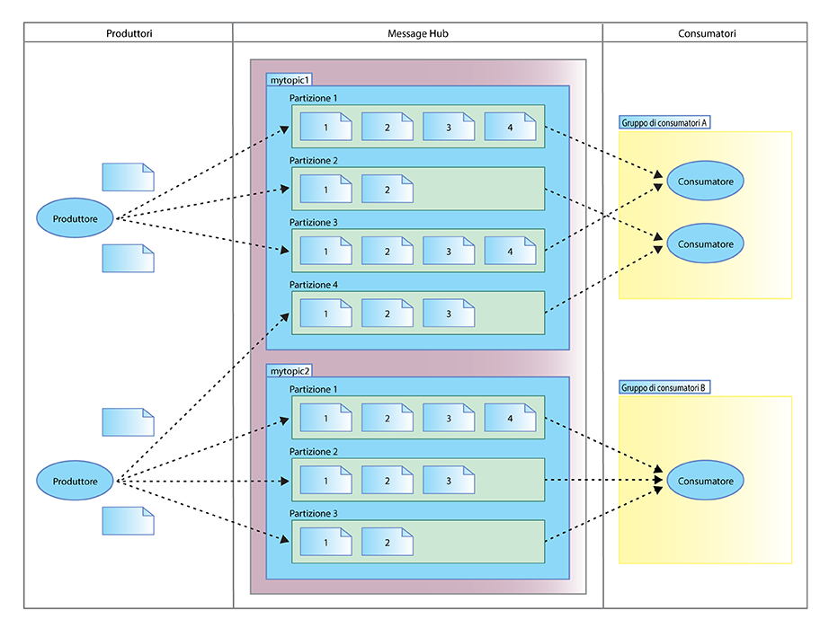

---

copyright:
  years: 2015, 2017
lastupdated: "2017-01-25"

---

{:new_window: target="_blank"}
{:shortdesc: .shortdesc}
{:screen: .screen}
{:codeblock: .codeblock}
{:pre: .pre}

# Message Hub e Apache Kafka
{: #apache_kafka}

Apache Kafka costituisce il nucleo di messaggistica affidabile di {{site.data.keyword.messagehub}}. È un
    sistema di messaggistica di pubblicazione-sottoscrizione ed è progettato per essere tollerante agli
    errori, fornendo una piattaforma ad elevata velocità effettiva e a bassa latenza per gestire dei
    feed di dati in tempo reale. Tali caratteristiche lo rendono ideale per l'utilizzo in un ambiente cloud.
{:shortdesc}

 

Il seguente elenco definisce alcun concetti di Apache Kafka:

<dl><dt>Argomento</dt>
<dd>Un feed in cui vengono pubblicati i messaggi.</dd>
<dt>Partizione</dt>
<dd>Ogni argomento si articola in una o più partizioni. Ogni partizione è un elenco ordinato di messaggi. Se un argomento
            ha più di una partizione, consente di eseguire il feed dei dati in parallelo per aumentare la velocità effettiva.</dd>
<dt>Produttore</dt>
<dd>Un processo che pubblica flussi di messaggi agli argomenti Kafka. Un produttore può eseguire
            pubblicazioni per uno o più argomenti e può, facoltativamente, scegliere la partizione che memorizza i dati.</dd>
<dt>Consumatore </dt>
<dd>Un processo che utilizza messaggi dagli argomenti Kafka ed elabora il feed di messaggi pubblicati. Un consumatore può sottoscrivere uno o più argomenti o partizioni.</dd>
<dt>Gruppo di consumatori</dt>
<dd>Uno specifico gruppo di uno o più consumatori. Ogni consumatore nel gruppo legge i messaggi da specifiche partizioni
            negli argomenti sottoscritti dal consumatore. Ogni messaggio viene recapitato a un singolo consumatore
            nel gruppo e tutti i messaggi con la stessa chiave vengono recapitati allo stesso consumatore.

Ogni partizione è assegnata solo a un singolo consumatore nel gruppo.
 
<ul>
<li>Se ci sono più partizioni che consumatori in un gruppo, alcuni consumatori hanno più partizioni.</li>
<li>Se ci sono più consumatori che partizioni, alcuni consumatori non hanno partizioni.</li>
</ul>
</dd>
</dl>

Per ulteriori informazioni, vedi la [documentazione di Apache Kafka ](http://kafka.apache.org/documentation.html){:new_window} e l'[articolo Message Hub Kafka Java&trade; API developerWorks&reg;](https://developer.ibm.com/messaging/2016/03/03/message-hub-kafka-java-api/){:new_window}.

