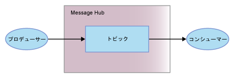

---

copyright:
  years: 2015, 2017
lastupdated: "2017-09-26"

---

{:new_window: target="_blank"}
{:shortdesc: .shortdesc}
{:screen: .screen}
{:codeblock: .codeblock}
{:pre: .pre}

# Message Hub入門
{: #messagehub}

{{site.data.keyword.messagehub_full}} は、アプリケーションおよびサービスが簡単かつ信頼できる方法で通信することを可能にする、スケーラブルで高スループットの分散型のメッセージング・サービスです。
{:shortdesc}

{{site.data.keyword.messagehub}} を使用して、以下のタスクを実行できます。

* バックエンド・ワーカー・プロセスに分担させることで負荷を軽減する
* ストリーム・データを Analytics に接続して強力な洞察を実現する
* 複数のアプリケーションにイベント・データを配信してリアルタイムで反応する
* 長期保管などの別のサービスにデータを転送する

{{site.data.keyword.messagehub}} を開始し、メッセージの送受信を開始するには、Java™ サンプルを使用できます。
このサンプルは、プロデューサーがトピックを使用してメッセージをコンシューマーに送信する方法を示します。同じサンプル・プログラムが、メッセージのコンシュームとメッセージのプロデュースに使用されます。




以下のステップを実行してください。
{: #getting_started_steps}
 
1. {{site.data.keyword.messagehub}} サービス・インスタンスを作成します。

  a. Web ユーザー・インターフェースを使用して {{site.data.keyword.Bluemix_notm}} にログインします。 
  
  b. **「カタログ」** をクリックします。
  
  c. **「アプリケーション・サービス」**セクションで、**{{site.data.keyword.messagehub}}** をクリックします。{{site.data.keyword.messagehub}} サービス・インスタンス・ページが開きます。
  
  d. **「接続」**メニューでサービスを未結合のままにし、サービス名と資格情報を入力します。デフォルト値を使用することができます。
  
  e. **「作成」**をクリックします。

2. 前提条件である以下の製品がまだインストールされていない場合はインストールします。

    * [git ](https://git-scm.com/){:new_window}
	* [Gradle ](https://gradle.org/){:new_window}
    * Java 7 以上
 
3. コマンド・ラインから次のコマンドを実行して、message-hub-samples git リポジトリーを複製します。

    <pre class="pre">
    git clone https://github.com/ibm-messaging/message-hub-samples.git
    </pre>
	{: codeblock}

4. 次のコマンドを実行して、ディレクトリーを java console sample に変更します。

    <pre class="pre">
    cd message-hub-samples/kafka-java-console-sample
    </pre>
	{: codeblock}

5. 次のビルド・コマンドを実行します。

    <pre class="pre">
    gradle clean && gradle build
    </pre>
	{: codeblock}

6. 次のコマンドを実行して、ご使用のコンソールでコンシューマーを開始します。

    <pre class="pre">java -jar build/libs/kafka-java-console-sample-2.0.jar 
	<var class="keyword varname">kafka_brokers_sasl</var> <var class="keyword varname">kafka_admin_url</var> <var class="keyword varname">api_key</var> -consumer</pre>
    {: codeblock}
    
    このサンプルでは、`kafka-java-console-sample-topic` という名前のトピックが使用されます。このトピックがまだ存在していない場合、このサンプルは {{site.data.keyword.messagehub}} 管理 API を使用して作成します。このサンプルは、メッセージの送受信には Apache Kafka Java API を使用します。

    *kafka_brokers_sasl*、*kafka_admin_url*、および *api_key* の値を調べるには、{{site.data.keyword.Bluemix_notm}} で {{site.data.keyword.messagehub}} インスタンスに移動し、**「サービス資格情報」**タブに進み、使用したい**資格情報**を選択します。
    
	**重要:** *kafka_brokers_sasl* は、単一ストリングでなければならず、引用符で囲む必要があります。以下に例を示します。

    <pre class="pre">
    "host1:port1,host2:port2"
    </pre>
	{: codeblock}

    選択した**資格情報**にリストされているすべての Kafka ホストを使用することをお勧めします。

7. 次のコマンドを実行して、ご使用のコンソールでプロデューサーを開始します。
   
    <pre class="pre">java -jar build/libs/kafka-java-console-sample-2.0.jar 
	<var class="keyword varname">kafka_brokers_sasl</var> <var class="keyword varname">kafka_admin_url</var> <var class="keyword varname">api_key</var> -producer</pre>
 {: codeblock}
  
8. これで、プロデューサーによって送信されたメッセージがコンシューマーで表示されるようになります。次に出力例の一部を示します。

    ```
    [2016-11-30 17:30:53,492] INFO Running in local mode. (com.messagehub.samples.MessageHubConsoleSample)
    [2016-11-30 17:30:53,492] INFO Updating JAAS configuration (com.messagehub.samples.MessageHubConsoleSample)
    [2016-11-30 17:30:53,506] INFO Kafka Endpoints: kafka01-prod01.messagehub.services.us-south.bluemix.net:9093,kafka02-prod01.messagehub.services.us-south.bluemix.net:9093,kafka03-prod01.messagehub.services.us-south.bluemix.net:9093,kafka04-prod01.messagehub.services.us-south.bluemix.net:9093,kafka05-prod01.messagehub.services.us-south.bluemix.net:9093 (com.messagehub.samples.MessageHubConsoleSample)
    [2016-11-30 17:30:53,506] INFO Admin REST Endpoint: https://kafka-admin-prod01.messagehub.services.us-south.bluemix.net:443 (com.messagehub.samples.MessageHubConsoleSample)
    [2016-11-30 17:30:53,506] INFO Creating the topic kafka-java-console-sample-topic (com.messagehub.samples.MessageHubConsoleSample)
    (com.messagehub.samples.MessageHubConsoleSample)e :{}
    [2016-11-30 17:30:54,947] INFO Admin REST Listing Topics: [{"name":"kafka-java-console-sample-topic","partitions":1,"retentionMs":"86400000","markedForDeletion":false}] (com.messagehub.samples.MessageHubConsoleSample)
    [2016-11-30 17:30:55,952] INFO [Partition(topic = kafka-java-console-sample-topic, partition = 0, leader = 0, replicas = [0,1,4,], isr = [0,4,1,]] (com.messagehub.samples.ConsumerRunnable)
    [2016-11-30 17:30:55,953] INFO class com.messagehub.samples.ConsumerRunnable is starting. (com.messagehub.samples.ConsumerRunnable)
    [2016-11-30 17:30:57,023] INFO [Partition(topic = kafka-java-console-sample-topic, partition = 0, leader = 0, replicas = [0,1,4,], isr = [0,4,1,]] (com.messagehub.samples.ProducerRunnable)
    [2016-11-30 17:30:57,024] INFO MessageHubConsoleSample will run until interrupted. (com.messagehub.samples.MessageHubConsoleSample)
    [2016-11-30 17:30:57,024] INFO class com.messagehub.samples.ProducerRunnable is starting. (com.messagehub.samples.ProducerRunnable)
    [2016-11-30 17:30:58,018] INFO Message produced, offset: 0 (com.messagehub.samples.ProducerRunnable)
    [2016-11-30 17:30:58,956] INFO No messages consumed (com.messagehub.samples.ConsumerRunnable)
    [2016-11-30 17:31:00,301] INFO Message consumed: ConsumerRecord(topic = kafka-java-console-sample-topic, partition = 0, offset = 1, CreateTime = 1480527060022, checksum = 1906962734, serialized key size = 3, serialized value size = 25, key = key, value = This is a test message #1) (com.messagehub.samples.ConsumerRunnable)
    [2016-11-30 17:31:00,397] INFO Message produced, offset: 1 (com.messagehub.samples.ProducerRunnable)
    [2016-11-30 17:31:02,550] INFO Message consumed: ConsumerRecord(topic = kafka-java-console-sample-topic, partition = 0, offset = 2, CreateTime = 1480527062401, checksum = 3801731428, serialized key size = 3, serialized value size = 25, key = key, value = This is a test message #2) (com.messagehub.samples.ConsumerRunnable)
    ```
	{: codeblock}
	
9. このサンプルは、ユーザーが停止するまで無期限に実行されます。処理を停止するには、<code>Ctrl+C</code> のようなコマンドを実行します。


Python を使用した {{site.data.keyword.messagehub}} サンプルの実行について詳しくは、[Python コンソール・サンプル・アプリケーション ](https://developer.ibm.com/messaging/2017/02/09/new-message-hub-sample-python-console-application/){:new_window} を参照してください。他の API およびフィーチャーを説明するためのサンプルも [{{site.data.keyword.messagehub}} サンプル ](https://github.com/ibm-messaging/message-hub-samples){:new_window} にあります。

{{site.data.keyword.messagehub}} に対する Java サンプルの実行方法を段階的に説明するビデオを視聴するには、[{{site.data.keyword.messagehub}} - Getting started with IBM's Kafka in the cloud ](https://www.youtube.com/watch?v=tt-bLtFzC_4){:new_window} をご覧ください。

