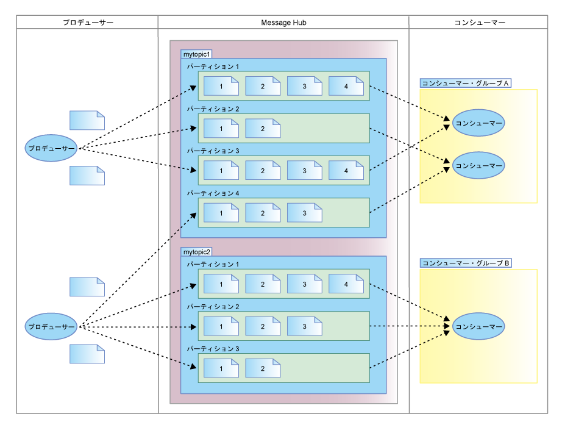

---

copyright:
  years: 2015, 2017
lastupdated: "2017-01-25"

---

{:new_window: target="_blank"}
{:shortdesc: .shortdesc}
{:screen: .screen}
{:codeblock: .codeblock}
{:pre: .pre}

# Message Hub と Apache Kafka
{: #apache_kafka}

Apache Kafka は、{{site.data.keyword.messagehub}} の信頼できるメッセージング・コアを形成しています。これは、耐障害設計のパブリッシュ/サブスクライブ・メッセージング・システムで、リアルタイム・データ・フィードを処理するためにスループットが高く待ち時間の短いプラットフォームを提供します。
こうした特長により、クラウド環境での使用に理想的です。
{:shortdesc}

 

以下に、Apache Kafka の概念をいくつか定義してリストします。

<dl><dt>トピック</dt>
<dd>メッセージがパブリッシュされる先のフィード。</dd>
<dt>パーティション</dt>
<dd>各トピックは、1 つ以上のパーティションから成ります。
各パーティションは、メッセージの順序付きリストです。
トピックに複数のパーティションがある場合、データを並行してフィードし、スループットを向上させることができます。</dd>
<dt>プロデューサー</dt>
<dd>Kafka トピックにメッセージのストリームをパブリッシュするプロセス。
プロデューサーは、1 つ以上のトピックにパブリッシュすることができます。
また、オプションで、データを格納するパーティションを選択できます。</dd>
<dt>コンシューマー</dt>
<dd>Kafka トピックからメッセージをコンシュームし、パブリッシュされたメッセージのフィードを処理するプロセス。
コンシューマーは、1 つ以上のトピックまたはパーティションをサブスクライブできます。</dd>
<dt>コンシューマー・グループ</dt>
<dd>1 つ以上のコンシューマーから構成される名前付きグループ。グループ内の各コンシューマーは、そのコンシューマーがサブスクライブする、トピック内の特定パーティションからメッセージを読み取ります。
各メッセージは、グループ内の 1 つのコンシューマーに配信され、同一のキーを持つメッセージはすべて、同一のコンシューマーに配信されます。

各パーティションは、グループ内の 1 つのコンシューマーのみに割り当てられます。
 
<ul>
<li>グループにコンシューマーより多くのパーティションがある場合、複数のパーティションを持つコンシューマーがあります。</li>
<li>パーティションより多くのコンシューマーがある場合、パーティションを持たないコンシューマーがあります。</li>
</ul>
</dd>
</dl>

詳しくは、[Apache Kafka 資料 ](http://kafka.apache.org/documentation.html){:new_window} および [developerWorks&reg; の Message Hub Kafka Java&trade; API のトピック ](https://developer.ibm.com/messaging/2016/03/03/message-hub-kafka-java-api/){:new_window} を参照してください。

